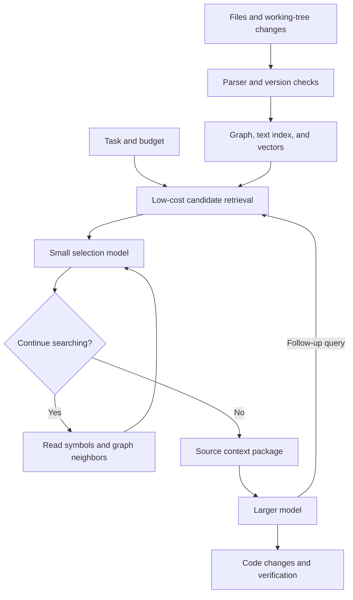

# A Small Code-Context Scout: Research and Experiment Plan

**Date: September 16, 2026.** Scope: a fast local context-retrieval model, Graphify-Labs/graphify, a custom minimal harness, and collaboration with GPT-6 Astra.

This document reviews sources and proposes experiments. No training or measurements on an RTX 2080 Ti have been performed. Latency targets, development timelines, and project budgets below are engineering estimates; findings from other projects are identified separately.

**Budget scope:** calls to the teacher and main models are currently excluded at the user's request. The budget covers training the scout, GPU resources, and infrastructure. Request volume and evaluation time remain part of the plan.

## 1. Conclusion

**The project is worth testing. The strongest starting point is a small, trainable context-retrieval and selection system inside a simple custom harness.** The repository graph lives outside the model and is updated as code changes. The larger model receives selected source snippets and can request further searches.

A realistic goal is to reduce retrieval time and cost while maintaining the task success rate. Quality improvements are possible, particularly for tasks involving relationships across files, but require a comparative experiment before any claim can be made.

Key decisions:

- Start with a graph, conventional search, and an existing reranker: a model that orders retrieved snippets by usefulness.
- Check whether this helps Astra before training a custom network.
- Then train an encoder with roughly 150M parameters; if the benefit is confirmed, compress it to 30–80M.
- First train snippet selection. Later, train search actions and stopping decisions.
- Measure the full task-solving loop, including repeated searches, index construction, caching, and tests.
- Keep diffusion and a variable number of MoE experts as separate research branches.

The combination of a small scout and a larger model already exists. Potential distinguishing features are local execution on an affordable GPU, a fresh graph of changing code, an adaptive search budget, and open evaluation of practical benefits.

## 2. Existing Work and What It Establishes

| Work / product | Connection to the idea | Implications |
|---|---|---|
| **SWE-grep / SWE-grep-mini, Cognition** | A specialized retrieval model that returns files and line ranges to the main agent; trained to search using tools | A direct precedent for the overall concept. The authors report speedups on their infrastructure, not measurements on a 2080 Ti or with Astra. [Primary source](https://cognition.com/blog/swe-grep) |
| **FastCode, March 2026** | Hybrid retrieval, a structural graph, progressive reading, and adaptive cost management | A close precedent for the proposed system. Compare against algorithmic retrieval as well as basic grep. [Paper](https://arxiv.org/html/2603.01012v1) |
| **LocAgent, ACL 2025** | Code localization through a graph of files, classes, functions, and dependencies | Supports using graphs to locate code that needs changes. Its trained model is substantially larger than the proposed scout. [Paper](https://aclanthology.org/2025.acl-long.426/) |
| **Aider repo map** | Graph-based selection of important symbols within a token budget | An essential low-cost baseline that requires no custom training. [Documentation](https://aider.chat/docs/repomap.html) |
| **Repoformer, 2024** | Learning to use external context selectively | A useful principle: learn when retrieval helps. The original task is code completion; transfer to bug fixing needs evaluation. [Paper](https://arxiv.org/abs/2403.10059) |
| **GraphCodeBERT, 2020** | Code representations that incorporate data flow, or dependencies between values | Learning from code structure has a long history. Adding a graph alone does not establish research novelty. [Paper](https://arxiv.org/abs/2009.08366) |
| **TinyAgent, 2024** | Specialized small models for function calling | Supports the feasibility of a narrowly scoped local agent. Its tasks and results are different from repository retrieval. [Paper](https://arxiv.org/abs/2409.00608) |
| **Agent Lightning v1.0, August 2026** | Training an agent directly inside its deployment harness | Supports the relevance of training with the execution environment. It is training infrastructure, not a ready-made small scout model. [Paper](https://arxiv.org/html/2608.17528v1) |

### Strongest practical evidence

Cognition describes SWE-grep as a separate search assistant with bounded search rounds, parallel tool calls, and references to source code. The company reports that its combination with Sonnet 4.5 solved the same task set faster. This supports the viability of separating these roles, but remains a developer report on its own configuration. The reported high generation throughput was achieved on Cerebras and does not characterize consumer GPUs. [Experiment description](https://cognition.com/blog/swe-grep)

### The remaining research question

**Can a model with at most 150M parameters, an external graph, and bounded search improve a strong agent's tradeoff between success, latency, and cost on unfamiliar repositories and changing code?**

This question is specific, allows for a negative result, and goes beyond reproducing an existing product's interface. Any future paper would still need to establish novelty relative to work available at publication time.

## 3. Assessing the Evidence for Graphify

### What it provides

Graphify-Labs/graphify uses tree-sitter for its structural pass over code, which requires no LLM. It builds a graph and provides retrieval and relationship exploration. Semantic processing of documents and other materials is a separate mechanism. The project distinguishes extracted, inferred, and ambiguous relationships; these labels describe edge provenance, not calibrated probabilities of correctness. [Graphify repository](https://github.com/Graphify-Labs/graphify)

### What its evaluations show

The published BENCHMARKS.md dated July 5, 2026 includes **6 code questions about ERPNext**. It reports an increase in reference-fact coverage from 70.8% to 82.0%. This measures answers to questions, not the share of bugs fixed. Its larger main tables concern conversational memory. These results are useful demonstrations, but insufficient to establish an advantage across repositories or with Astra. [Published setup and results](https://raw.githubusercontent.com/Graphify-Labs/graphify/v8/BENCHMARKS.md)

### How to use it in this project

Treat Graphify as a source of external structure and an existing retrieval option. It is **not a neural-network training algorithm**.

Proposed responsibilities:

1. The parser and language tools extract structure.
2. The index stores files, symbols, relationships, and versions.
3. The trainable model decides which snippets are needed for the current task.
4. The harness executes searches, checks versions, and assembles the response.

There is no need to train separate weights for every repository. The model should transfer its selection skill to new code and obtain facts about the current project from the index.

A static graph is incomplete: dynamic dispatch, reflection, dependency injection, configuration, SQL, templates, and generated files introduce relationships that are difficult to recover from the AST alone. An absent edge therefore cannot establish the absence of a dependency. Store the provenance and reliability of relationship types; add compiler or LSP information for typed languages.

An integration requirement is to verify symbol existence, line ranges, and file freshness when reading. A line number is an address within a version, not a permanent identifier.

## 4. What the Model Should Predict

Inputs are the user's task, current search state, a bounded candidate set, graph features, and remaining budget. Outputs are candidate scores and, later, the next action.

A weak training objective is to recover the path of the patched file. It encourages memorizing names and ignores context required to solve the task correctly.

A more useful objective is to **assemble a small set of source snippets that gives the main model a high probability of solving the task**.

For example, consider a task where a retry still starts after a request is cancelled. Useful context might include:

- the cancellation handler;
- the retry loop;
- the cancellation-token interface;
- the calling function;
- a test of the expected behavior.

The file containing the eventual fix is only part of that set. Two snippets may be useful only together, so independent top-k selection by similarity is not always sufficient.

### Response format

The following is an illustrative protocol. Ordinary code constructs the JSON; the model selects existing identifiers.

```json
{
  "snapshot_id": "repo-state-42",
  "hits": [
    {
      "symbol_id": "retry-loop-17",
      "path": "src/retry.py",
      "start_line": 80,
      "end_line": 123,
      "content_hash": "sha256:...",
      "role": "implementation",
      "text": "...source code..."
    }
  ],
  "next_action": "expand_callers",
  "next_target_ids": ["retry-loop-17"],
  "stop_reason": null,
  "budget_remaining_tokens": 4200
}
```

The external response must include content or an immediate way to read it through a tool. A local path alone does not transmit code to a cloud model.

A ranking score should not be presented as 95% confidence that the context is sufficient. That probability requires a separately trained and evaluated calibrator. Initially, explicit stopping reasons are enough: the budget is exhausted, there are no new candidates, or further search has been requested.

## 5. Recommended Architecture



### 5.1. Indexing

Parse the repository once, then update changed files and affected relationships. Store AST boundaries, signatures, content, references, tests, and metadata. Avoid automatically indexing dependencies, build outputs, minified files, and large duplicates.

A live editor needs a snapshot that includes uncommitted changes. If the index is older than a file, revalidate it or read the current file directly. Use text search as a fallback for incomplete syntax.

### 5.2. Low-cost retrieval

Combine exact identifier search, BM25, which weights words by their rarity, and vector similarity. Merge results and add a bounded number of graph neighbors. Initial experimental settings: 100–300 candidates before filtering and 16–64 before expensive scoring. These are hyperparameters to test, not established optima.

If a required snippet never enters the candidate set, the reranker cannot recover it. Measure initial retrieval recall separately.

### 5.3. Two neural-component options

**Lowest cost:** precomputed code vectors, a query vector, and a small network that also uses relationship type, graph distance, lexical matches, and snippet cost. This avoids passing source code through a large encoder for every query.

**Higher accuracy:** a cross-encoder reads the query together with each of a few dozen snippets. This costs more but can account for details lost in a precomputed vector.

A practical cascade is cheap scoring of all candidates, followed by a cross-encoder for the uncertain top candidates, then context assembly. Report the encoder, embedder, and ranking heads when stating system size. A 5M head on top of a resident 600M model does not make the entire system a 5M model.

### 5.4. Initial comparison models

- **Qwen3-Reranker-0.6B** is a ready-made baseline supporting multiple languages and code. Its scoring example uses yes/no logits; lengthy reasoning generation is not required. [Model card and inference example](https://huggingface.co/Qwen/Qwen3-Reranker-0.6B)
- **ModernBERT-base, 149M** is a candidate for training a custom query–code scorer. It is a pretrained backbone, not a ready-made ideal search model. Its pretraining includes code. [Model card](https://huggingface.co/answerdotai/ModernBERT-base)
- After successful fine-tuning, train a **30–80M** student to reproduce useful scores and decisions from a stronger teacher. This range is a project target.

For Russian queries, evaluate quality separately and compare query translation, mixed RU/EN training, and a multilingual reranker. Translations of the same task must stay in the same dataset split.

### 5.5. Where speed comes from

The main expected gain comes from reducing repeated work: avoid reading the entire repository on each query, avoid generating long responses, cache unchanged code, keep weights loaded, and score short snippets in batches.

For the initial experiment, the proposed warm-retrieval target is a **100–300 ms median and under 1 second for 95% of requests** on an already indexed project. This is an ambitious evaluation target, not a forecast for every 2080 Ti configuration. Measure cold starts and index updates separately.

A direct PyTorch service is a sufficient starting point for an encoder. Replacing Ollama with vLLM does not resolve the design question: first choose the architecture and measure its inference. A more complex generation server becomes relevant if the system actually uses a generative model with an appropriate workload.

## 6. Why Build a Minimal Custom Harness?

A harness is the program that maintains state, calls the model and tools, enforces limits, and records outcomes. **A custom harness is useful for both execution and collecting training trajectories.**

Start with two logical loops in one application:

- The inner loop lets the scout retrieve context, read code, and decide what to return.
- The outer loop lets the stronger model analyze the task, change code, and run checks.

Separate processes or multiple conversational agents are optional. A clear protocol between retrieval and problem solving matters more.

A standalone mode without the larger model is also possible: a local tool can find symbols, show dependencies, assemble context, and suggest related tests. This is a useful initial product. Autonomous code editing would require separate training and evaluation of patch generation; retrieval success does not establish reliable problem solving.

### Minimal scout environment

| Action | Responsibility of ordinary code | Model decision |
|---|---|---|
| `search` | Execute text and vector retrieval | Choose a candidate query; later, refine the query |
| `read_symbols` | Read existing ranges | Select symbol identifiers |
| `expand_neighbors` | Retrieve relationships of a given type | Select nodes, relationship type, and depth |
| `find_tests` | Find available tests through the index | Select candidates to inspect |
| `emit_context` | Check versions and merge snippets | Select and order snippets |
| `request_fallback` | Return control to the main model | Decide when the scout budget is exhausted or search is unproductive |

Implement path validation, available actions, deduplication, token budgets, timeouts, and tracing deterministically. The initial scout only needs read access; code changes and test execution remain in the outer loop.

The simplest baseline has no learned action policy: the harness always runs retrieval, one neighbor-expansion pass, and reranking. This is an essential control. A learned policy is justified only if it saves time or improves quality over this fixed sequence.

### Training inside the harness

1. **Record demonstrations.** A strong teacher or a person uses the same tools. Store observations, selected IDs, actions, and outcomes.
2. **Learn from examples.** Start with ranking and imitation of successful short trajectories. Avoid copying the teacher's entire verbose conversation.
3. **Collect student errors.** Obtain corrected actions for states the student actually visits. Otherwise, search errors accumulate after the first deviation from a demonstration.
4. **Add outcome-based learning.** Compare context sets or retrieval strategies by usefulness to the solver, time, and cost.
5. **Evaluate transfer.** Use other repositories, another main model, and at least one other harness.

For a single decision, such as selecting a budget or search strategy, a contextual bandit is initially sufficient: learn an action choice from its outcome. A sequence of dependent actions is a setting for full reinforcement learning, or RL.

Training must use only observations available to the model at that moment. Logs need repository and harness versions, available actions, arguments, results, and resource usage. A stored trajectory describes one visited path; it does not automatically reveal the result of an unvisited action. Comparing alternatives requires new runs or replaying tools on the same snapshot. Update weights through separately evaluated versions rather than automatically after each user request.

One possible training objective:

```text
utility = task success
          − time penalty
          − cost penalty
          − penalty for stale or invalid references
```

Tune coefficients on validation data. A more reliable product objective is to minimize latency and cost **subject to a limit on acceptable degradation in task success**. A single scalar reward can conceal a loss of quality.

End-to-end task success is a noisy and expensive signal. An Astra failure does not necessarily imply poor context; a correct answer does not establish that every supplied snippet was needed. Start with cheap retrieval metrics, then run selected paired solver evaluations. Astra can remain unchanged: only the scout's weights are updated, with no gradients through the closed model.

### Research support

mini-SWE-agent shows that a useful agent loop can be very simple. It provides a good reference for a research harness and reproducible trajectories. Its results depend on the main model. [Repository](https://github.com/SWE-agent/mini-swe-agent)

In Agent Lightning v1.0, the authors train Qwen3.5-9B with mini-SWE-agent and report an increase on SWE-bench Verified from 41.8% to 56.4% under their protocol, using about 6,000 training tasks. This is evidence for training inside a harness, not a promise of similar gains for a 50M scout or a resource estimate for one 2080 Ti. [Paper and setup](https://arxiv.org/html/2608.17528v1)

The proposed classification model does not require a full RL infrastructure at the outset. A simple loop, logs, and PyTorch can test much of the hypothesis. Add Agent Lightning or a similar stack when large-scale trajectory collection and training a multi-step generative policy become necessary.

## 7. Data Sources and Generation

### Existing sources

| Source | Role in the project | Limitation |
|---|---|---|
| **SWE-smith** | Tasks with injected bugs, fixes, and executable checks; a basis for generating retrieval trajectories | Synthetic bugs do not cover the full distribution of real tasks. Tens of thousands of examples are available; select a high-quality subset. [Project](https://swesmith.com/) |
| **CodeSearchNet** | Additional description–function pairs for learning semantic alignment | Retrieving a function from its description is easier than assembling context for a bug spanning files. [Dataset](https://github.com/github/CodeSearchNet) |
| **ContextBench** | Primarily independent evaluation of context retrieval | Keep its tasks and overlapping repositories out of training. [Paper](https://arxiv.org/abs/2602.05892) |
| **Authorized repositories and real tasks from our own work** | User phrasing, uncommitted changes, and the student's retrieval errors | Reserve a separate set of projects and tasks that training never sees |

ContextBench contains 1,136 tasks from 66 repositories across eight languages, with context annotations. Its authors measure recall, precision, and use of retrieved code. Their results show that a more complex harness does not guarantee better retrieval. The benchmark builds on existing task datasets, so check for overlap when combining sources. [Methodology](https://arxiv.org/html/2602.05892v1)

### Can a model generate the dataset?

Yes. The most useful synthetic data is grounded in **executable code and verifiable changes**. Invented repositories and supposedly correct references produce overly simple and often incorrect examples.

Proposed pipeline:

1. Select a real project snapshot and a task with a verifiable solution.
2. Index the original, unfixed state.
3. Retrieve candidates using several methods, including false matches.
4. Give the teacher the task and the same tools available to the student.
5. Collect required symbols, useful relationships, and a short action sequence.
6. Validate IDs, ranges, versions, and test executability with ordinary code.
7. For a subset of examples, run the solver with this context and compare several context sets.
8. Manually review ambiguous cases and systematic labeling errors.

The fix diff can be an auxiliary labeling source, but must not be a retrieval input. A teacher shown the solution may reveal names and causal relationships unavailable during real use. Keep these hints separate from the student's observations.

### Luna as a teacher, Astra as the solver

One proposed experiment is to use **GPT-5.6 Luna to generate training examples**, train the local scout on those examples, and deploy the scout as a retrieval tool for **GPT-6 Astra**. The teacher and downstream solver do not have to be the same model. Luna supports function calling and structured outputs, which can help collect search demonstrations and candidate judgments in a consistent format. [Luna documentation](https://developers.openai.com/api/docs/models/gpt-5.6-luna)

This trains **our scout**, using teacher outputs as supervision. It does not require fine-tuning Luna, accessing its weights, or propagating gradients through either hosted model. Supervised training on these examples is distillation; it is not by itself reinforcement learning.

Suggested experiment:

1. Let Luna inspect real task snapshots through the harness and propose relevant symbol IDs, candidate preferences, and short search trajectories.
2. Validate locations and snapshot versions, run available checks, and retain uncertainty instead of turning every omission into a negative label.
3. Review a sample of labels and difficult cases with a person or Astra. Keep those judgments separate from independent final evaluation.
4. Train the scout, freeze its version, and compare Astra with and without it on held-out repositories under matched tool and context budgets.

The main uncertainty is **whether the learned retrieval behavior transfers**. Context that helps Luna may be incomplete or redundant for Astra, and the scout may inherit Luna's search mistakes. Luna's ratings alone therefore cannot establish an improvement for Astra. If the transfer is weak, use Astra feedback on separate training or development tasks to refine the data or ranking objective, then evaluate on a fresh held-out set. Teacher and solver call charges remain outside the current budget scope.

### Three levels of label quality

**Low cost:** changed symbols, discovered references, and nearby tests. These are weak labels; they do not establish usefulness for solving the task.

**Medium cost:** a teacher evaluates candidates using all available context and selects groups that are useful together. A person reviews a sample of these judgments.

**High cost:** compare the larger model's results under different context sets. Remove snippets individually or in groups and measure changes in success. This approximates a causal check; generation variability requires repeated trials rather than a single teacher response.

Do not label every unselected snippet as negative: some may be valid alternative context. Keeping positive, verified-negative, and unknown labels is more useful than assuming the annotations are complete.

### Using the graph during training

- Supply relationship types, distances, node roles, and extraction reliability as features.
- Add auxiliary tasks involving references and relationships between symbols.
- Train selection among implementations, callers, tests, configuration, and interfaces.
- Include hard negatives: functions with the same name, a similar module, an outdated version, or a neighbor that does not help the task.
- Evaluate the usefulness of sets: an implementation without its caller is often insufficient.

The primary label should reflect utility for the task. Learning only to reproduce graph adjacency would create an expensive replacement for graph traversal.

### Initial data volume

For the first cycle, the proposed starting point is **5,000–20,000 distinct training tasks** with candidate sets and **200–500 carefully reviewed development and diagnostic tasks**, separated by purpose. This is an initial estimate; the required volume should be determined by the quality curve as data is added.

A thousand tasks with 32 candidates each produce 32,000 pairs, but still only a thousand independent tasks. Dataset row count does not replace project diversity.

Keep the final test set separate. Split by repository, fork family, task, and time; remove near-duplicate code across splits. Git history and access to future fixes must not reveal the answer. Store the provenance and usage terms of source data and teacher models for each example.

## 8. Demonstrating Value with Astra

### Systems to compare

| Variant | What it tests |
|---|---|
| A. Strong model with conventional search/read | Practical baseline |
| B. Same model with existing graph retrieval and no custom training | Contribution of indexing and structure |
| C. B with an existing reranker | Whether a custom neural model is needed |
| D. B with a custom trained encoder | Contribution of task-specific training |
| E. D with a learned action policy | Contribution of an adaptive minimal harness |
| O. Human-verified reference context | Approximate potential benefit of ideal retrieval |

Hold the main model, settings, code-editing tools, available source, time limits, and success criteria fixed across variants. A competent baseline matters more than a flattering comparison against a weak grep-like script.

Evaluate two modes separately:

1. **Fixed context:** the solver receives only the selected snippets. This helps diagnose retrieval losses.
2. **Working agent:** the solver can read missing information. This is the primary practical test; account for all additional reads and their resource use.

### Metrics

- **Candidate recall:** whether the required code reaches the initial candidate list.
- **Selected-context recall and precision:** how much relevant material is found and how much irrelevant material is supplied, including under a fixed token budget.
- **Evidence-group coverage:** whether jointly required implementations, calls, tests, and configuration are retrieved together.
- **End-to-end task success:** patches pass independent checks; answers to questions are verified against source code.
- **Cost per successful solution:** total expenditure on all attempts, including failures, divided by the number of successful tasks.
- **Time to solution:** median and 95th percentile, separately for retrieval and the full loop.
- **Freshness:** the rate of stale references after edits, renames, and branch switches.
- **Transfer:** performance on new repositories, languages, and another strong model.

A ranking metric alone does not establish practical value. Conversely, slightly lower recall may be acceptable if the main agent quickly recovers omissions and solves tasks more cheaply. Missing context has a much higher cost when additional reading is prohibited.

### Avoiding misleading conclusions

Use the first 50–100 tasks to identify major failures and estimate effect size. Claiming that quality barely deteriorates requires a larger paired evaluation with confidence intervals; the number of tasks depends on how often the variants disagree. A hundred tasks usually cannot convincingly establish a difference of about one percentage point.

Use paired comparisons on identical tasks, repeated runs under noisy conditions, analysis by repository, and bootstrap resampling grouped by project. Publish failure cases alongside averages. Do not select the best configuration using the final test set.

### Proposed criteria for continuing

These are product targets for the experiment, not promised results. While model-call costs are excluded from the budget, time at a maintained success rate is the main criterion; monetary savings can be evaluated later:

- at least **20% lower total cost** or **15% less end-to-end time**;
- no decline in success beyond a predefined tolerance, such as **2 percentage points**, with sufficient statistical confidence;
- benefits on several unfamiliar projects;
- benefits persist after accounting for caching, indexing, and repeated reads.

If even reference context offers little benefit, stop the expensive scout-training effort for that scenario. If an untrained graph system already meets the target, it can serve as the product; justify any neural component through a separate measurement.

## 9. Can It Help GPT-6 Astra?

**Integration is technically feasible. The size of the practical benefit is unknown.** This review did not find a published comparative evaluation of the proposed scout with Astra.

At the time of this review, official documentation lists function calling, structured outputs, and MCP support for Astra. It can use a tool that returns retrieved code without fine-tuning Astra itself. [Model documentation](https://developers.openai.com/api/docs/models/gpt-6-astra)

Two integration paths:

- **Custom harness through the API:** the application receives Astra's tool request, calls the local scout, and returns the result. [Function calling](https://developers.openai.com/api/docs/guides/function-calling)
- **Use inside Codex:** expose retrieval through a local MCP server. This gives the agent another tool; its behavior and decisions about when to call it need practical evaluation. [MCP documentation](https://learn.chatgpt.com/docs/extend/mcp?surface=cli)

The scout is especially promising for large projects, repeated requests against the same index, and tasks whose required code is scattered across dependencies. It is less promising when the user already identifies the exact function, the project is small, or reasoning and long-running tests dominate execution time.

A large context window does not eliminate the value of retrieval: processing time and cost still matter. It does, however, strengthen the baseline against which the scout must be compared fairly.

### Retrieval speed versus total task time

Illustrative calculation: retrieval accounts for 30% of total time, it becomes ten times faster, and everything else stays unchanged. The overall speedup is:

```text
1 / (0.70 + 0.30 / 10) = 1.37 times
```

This is a mathematical example, not an Astra measurement. It shows why a tenfold retrieval speedup does not imply a tenfold agent speedup.

### Account for caching

Caching reuses a matching prompt prefix. Reordering earlier context can reduce reuse. Prefer appending new retrieval results and account separately for cache-write and cache-read charges. [Official documentation](https://developers.openai.com/api/docs/guides/prompt-caching)

Reducing input by 80% therefore does not imply an 80% reduction in the total bill: output, reasoning, tools, repeated calls, and different cached-token rates remain relevant.

## 10. Dynamic MoE and Diffusion

### Possible meanings of a dynamic expert count

1. A fixed pool of weights exists, but different requests activate one, two, or more experts.
2. Experts are added, removed, or merged during training.
3. New experts are created and trained for new projects during use.

The first two options have already been studied, including in DynMoE. The third introduces additional problems involving new-expert quality, data, version switching, and forgetting. [DynMoE](https://arxiv.org/abs/2405.14297)

For a small local scout, routing and loading different weights may consume the expected compute savings. Fewer active parameters also do not imply less total memory for all stored experts.

First make the **amount of work** adaptive: candidate count, traversal depth, whether a cross-encoder is needed, and the number of rounds. This is easier to evaluate against actual latency.

For an MoE-specific experiment, use a shared text encoder with 2–4 small trainable heads that score different relationships. Compare fixed and adaptive selection. Heads do not automatically become database or authorization experts; measure specialization. Compare against a dense network at equal latency and total memory.

### Is a diffusion model needed?

Generative diffusion has no obvious advantage when selecting IDs from an existing candidate list: a classifier can score candidates in one pass. Iterative refinement of a set is a possible research topic, but first show that it outperforms simple ranking or a few retrieval actions.

Graph-based score propagation, such as PageRank or message passing, uses a different meaning of diffusion. It may be a useful low-cost retrieval component and does not require training a diffusion language model.

For a useful tool on a personal computer, the recommended order is **encoder, adaptive retrieval, then MoE if needed**. Researching generative diffusion itself would be a separate project with different metrics and data.

## 11. Resources: What Is Feasible on an RTX 2080 Ti?

### Practical options

| Workload | Assessment for a 2080 Ti with 11 GB VRAM |
|---|---|
| Text-index and graph construction | Primarily a CPU, RAM, and disk workload |
| Inference with a 30–150M encoder on short snippets | A realistic starting target; measure actual batch size and latency |
| Fine-tuning an encoder of about 150M | Realistic with short sequences and small batches; use gradient accumulation where needed |
| Training a small head over existing vectors | The cheapest option; possible without a large GPU |
| LoRA for a model of roughly 0.6–1B | Possible with suitable context length and configuration; not guaranteed for an arbitrary stack |
| Full AdamW fine-tuning of a 1B model | A conventional configuration is tight for 11 GB even before activations; use a smaller model or adapters |
| Multi-step RL with long generations | Inconvenient for the first project: inference, rollouts, and training compete for memory and time |

This table is a resource estimate, not a completed benchmark.

For reference, FP16 weights alone take about 2 bytes per parameter: 50M is approximately 100 MB, 149M about 298 MB, and 1B about 2 GB. Training adds gradients, optimizer state, possible weight copies, and activations. Static state for conventional encoder training may take roughly 12–20 bytes per parameter, depending on the implementation; activations are additional.

The 2080 Ti is a Turing GPU. Use a validated FP16 path rather than assuming BF16 or FlashAttention recipes for an H100 will transfer. At the time of this review, the main FlashAttention-2 CUDA path targets newer architectures; its documentation points to a separate Turing project with a subset of features. [Compatibility](https://github.com/Dao-AILab/flash-attention)

### RAM and disk

For the pilot, the proposed starting point is **32 GB RAM** and **50–150 GB of free SSD space**, downloading only the projects, weights, and selected environments needed. For numerous test containers, 64 GB RAM and a 500 GB–1 TB SSD are more convenient. These are development allowances; a particular environment collection may need more.

The vector index alone is often much smaller than the corpus: 100,000 vectors with 384 FP16 components require **76.8 MB of raw vectors**. ANN search structures, the graph, metadata, text, and duplicate versions add to that total. Raw vector size is not the size of the entire system.

### Keeping the model resident

Yes. A persistent process can load weights once, warm up inference, and serve requests. Memory stays allocated between requests, but training does not continue automatically. An encoder does not need a large generative KV cache between independent tasks.

Keep the graph and main index in RAM or on SSD, and use the GPU for the model. Repository updates change the index; weights do not need retraining after each file save.

### Is training from scratch necessary?

Not for the initial result. A pretrained encoder already captures text and code patterns; the task is to teach useful selection. A small head or graph network over existing representations can be trained from scratch inexpensively.

Pretraining a language model from scratch requires a separate corpus, tokenization, and many experiments. It is unnecessary for investigating a novel retrieval policy and makes failures harder to diagnose.

## 12. Budget and Timeline

### GPU rental

Prices from Runpod's public GPU Pods page as of the research date. Check availability, configurations, and associated charges before launching a job:

| GPU | VRAM | Listed hourly price | 24 hours |
|---|---:|---:|---:|
| RTX A5000 | 24 GB | $0.27 | $6.48 |
| RTX 3090 | 24 GB | $0.50 | $12.00 |
| RTX 4090 | 24 GB | $0.74 | $17.76 |
| A100 | 80 GB | $1.59 | $38.16 |

This is not a training-throughput comparison. A cheaper hour can lead to a more expensive completed experiment. Storage and other services are additional. [Runpod pricing](https://www.runpod.io/pricing)

An existing 2080 Ti is sufficient to start with a custom encoder. Renting a 24 GB GPU can make configuration sweeps more convenient. An A100 is justified if measurements show that memory or throughput has become the bottleneck.

### Estimating training duration

Before promising overnight training, run 200–500 steps and measure throughput at the chosen sequence lengths and batch size.

Illustrative pairwise-training workload:

```text
10,000 tasks × 32 candidates × 256 tokens × 3 epochs
= 245,760,000 processed tokens

time ≈ tokens / measured tokens per second
```

The 256 tokens include the query, snippet, and formatting. Longer actual sequences or padding increase the workload.

| Hypothetical measured throughput | Training time alone | At $0.74/hour |
|---:|---:|---:|
| 2,000 tokens/s | 34.13 hours | $25.26 |
| 10,000 tokens/s | 6.83 hours | $5.05 |
| 30,000 tokens/s | 2.28 hours | $1.68 |

**This is a sensitivity analysis, not a GPU benchmark.** None of these rows is promised for a 2080 Ti or a particular model. Preparation, validation, idle time, and repeated experiments add to the cost.

### Current budget scope

Calls to the teacher and Astra are excluded from the current estimate. This defines the scope of the calculation; it does not imply those calls are free. Included items are:

- GPU rental for training and local inference;
- cloud storage and, where needed, CPU environments for tests;
- electricity when using a personal computer;
- development, data preparation, and evaluation time, recorded separately from monetary expenses.

Evaluation volume is unchanged: for example, 100 tasks × 2 systems × 3 repetitions equals 600 runs. Their model-call charges are excluded, but duration and available parallelism still affect the calendar schedule.

### GPU spending scenarios

These scenarios allocate GPU hours; they do not predict required training time. They use the RTX 4090 rate of $0.74/hour from the table above.

| Scenario | Rental allocation | GPU cost |
|---|---:|---:|
| Prototype and initial training on an existing 2080 Ti | 0 rented hours | $0 rental; electricity is additional |
| Short cloud experiment | 5–20 GPU-hours | $3.70–14.80 |
| A series of training runs and comparisons | 20–100 GPU-hours | $14.80–74.00 |
| Extended sweeps or search-policy experiments | 150–800 GPU-hours | $111–592 |

Cloud storage, additional CPUs, and idle time are extra. The required GPU hours will become clearer after a training pilot and selection of the experiment count. The final row is not an estimate for full RL training of a large generative model.

### Planning allowance and timeline

For the first cycle of minimal harness, data, encoder, and comparison, a reasonable allowance is **$50–200 for optional rental and infrastructure**, while retaining the option to run entirely on an existing GPU. This is a reserve, not a required expenditure or a guaranteed upper bound.

Excluding API expenses does not automatically shorten the schedule:

| Stage | Planning estimate for one developer |
|---|---|
| Test the idea without custom training | 1–2 weeks |
| Encoder, data, and paired evaluation | Another 2–6 weeks |
| Multi-step policy and broad evaluation | Another 1–3 months if this stage is pursued |

The main constraints are now annotation quality, task diversity, experiment time, and valid comparisons. Under this budget assumption, select the teacher for annotation quality without optimizing its price.

Rental services provide compute; datasets such as SWE-smith provide tasks and tools to create them. The central intellectual work is defining metrics, validating data, and analyzing failures.

## 13. Roadmap for the First Eight Weeks

### Weeks 1–2: establish whether there is a useful effect

- Start with Python because executable software-engineering data is available; add the user's other languages in a subsequent independent evaluation.
- Select several projects, create controlled snapshots, and assemble 50–100 diagnostic tasks.
- Build a minimal harness, graph adapter, text search, symbol reading, and resource-usage logging.
- Compare conventional search, an untrained graph system, an existing reranker, and manually selected context.
- Check updates after edits and measure actual latency on the available GPU.

**Decision:** if ideal or well-curated context does not improve useful metrics, refine the target scenario before scaling training.

### Weeks 3–4: prepare data and train the first model

- Prepare an initial 5K tasks, diverse candidates, and hard negatives.
- Hold out separate projects for tuning and the final test.
- Train a 149M encoder; compare it with an existing reranker and a simple head over vectors.
- Check whether graph information adds value beyond text features.
- Version all datasets, models, and harness configurations.

**Decision:** the trained model must offer value over existing components. If it does not, use the simpler option.

### Weeks 5–6: reduce latency and evaluate end-to-end value

- Try a 30–80M student, shorter representations, batching, and suitable quantization.
- Run paired evaluations with Astra, including normal follow-up retrieval.
- Measure cold starts, warm queries, and updates after code changes.
- Check that reducing input does not undermine caching benefits.

**Decision:** accept or reject the model based on total cost and task success; the speed of one layer is insufficient.

### Weeks 7–8: learn action selection

- Record states where fixed retrieval wastes resources or misses context.
- Train the choice between reading, expanding, stopping, and returning control.
- Evaluate on new projects and with another main model.
- Add a second language and live-editing scenarios.

Full RL, new MoE architectures, and broader evaluation suitable for publication may extend beyond these eight weeks. Part-time development will take longer.

## 14. Potential Differentiators

The most promising formulation for this project is:

> A local scout with small model weights that selects sufficient context from a live code graph and learns to allocate its retrieval budget inside a simple, open harness.

Four testable directions:

1. **Freshness.** Handle incomplete edits, renames, and branch switches; evaluate stale recommendations.
2. **Joint utility.** Select small groups containing implementation, caller, contract, and test, rather than relying only on independently similar snippets.
3. **Learned budgets.** Use one search for a simple question and several structural steps for a harder one; evaluate actual solution cost.
4. **Accessible hardware and reproducibility.** Release weights, data, and the harness, with 2080 Ti measurements and comparisons against strong standard tools.

No individual item guarantees research novelty. Value may come from a convincingly evaluated combination, a high-quality dataset, and a useful working tool.

## 15. Final Recommendation

**Start with a minimal harness and graph retrieval, then train a small encoder.** This sequence will reveal whether the benefit comes from the index, neural model, action policy, or their combination.

Integration with Astra is technically feasible and has a plausible path to practical value. Direct evidence of the size of the benefit for Astra is still missing. An existing 2080 Ti is suitable for initial substantive experiments. With teacher and solver calls excluded, the main cash budget covers optional GPU rental and infrastructure; data quality and evaluation time are the primary constraints.

The first result to aim for is **a local assistant that needs no retraining for each repository and measurably reduces a strong agent's time or resource use on new tasks while maintaining task success**.
