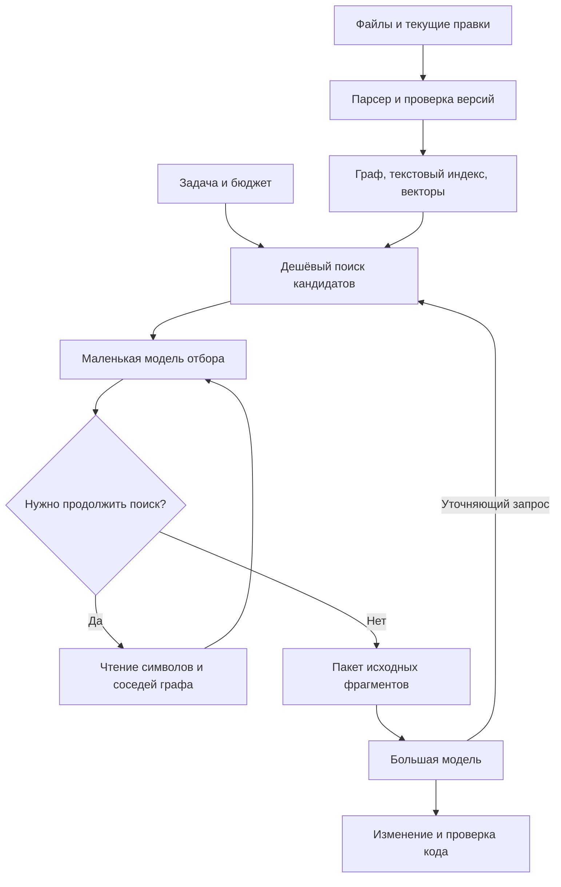

# Микромодель-скаут для кода: исследование и план эксперимента

**Дата: 16 сентября 2026.** Предмет: локальная быстрая модель поиска контекста, граф Graphify-Labs/graphify, собственный микро-harness и работа вместе с GPT‑6 Astra.

Это исследование источников и проект эксперимента. Обучение и измерения на RTX 2080 Ti не проводились. Приведённые ниже целевые задержки, сроки разработки и бюджеты проекта — инженерные оценки; результаты чужих работ отмечены отдельно.

**Уточнение бюджета:** по пожеланию пользователя стоимость вызовов модели-учителя и основной модели пока исключена. Считаем собственное обучение, GPU и инфраструктуру. Объём запросов и время проверок остаются частью плана.

## 1. Вывод

**Проект стоит пробовать. Наиболее обоснованный вариант — маленькая обучаемая система поиска и отбора контекста внутри собственного простого harness.** Граф репозитория хранится снаружи модели и обновляется после изменений. Большая модель получает выбранные исходные фрагменты и может запросить дополнительный поиск.

Реалистичная цель: уменьшить время и стоимость поиска при сохранении доли решённых задач. Повышение качества возможно, особенно на задачах со связями между файлами, но его нельзя обещать до сравнительного эксперимента.

Главные решения:

- Начать с графа, обычного поиска и готового reranker — модели, которая переставляет найденные фрагменты по полезности.
- Проверить, помогает ли это Astra, до обучения своей сети.
- Затем обучить encoder около 150M параметров; при подтверждённом выигрыше сжать его до 30–80M.
- Сначала учить выбирать фрагменты. Позже — выбирать действия поиска и момент остановки.
- Измерять весь цикл решения задачи, включая повторный поиск, построение индекса, кэш и тесты.
- Диффузию и изменяемое число MoE-экспертов оставить отдельными исследовательскими ответвлениями.

Само сочетание «маленький скаут + большая модель» уже существует. Потенциальное отличие проекта — работа локально на доступной GPU, свежий граф изменяемого кода, адаптивный бюджет поиска и открытая проверка реальной пользы.

## 2. Что уже существует и что это доказывает

| Работа / продукт | Что близко к идее | Как учитывать |
|---|---|---|
| **SWE-grep / SWE-grep-mini, Cognition** | Специализированная модель поиска, выдающая файлы и диапазоны строк основному агенту; обучение поиску с инструментами | Прямой аналог общей концепции. Авторы сообщают ускорение на собственной инфраструктуре; это не замер на 2080 Ti и не проверка с Astra. [Первичный источник](https://cognition.com/blog/swe-grep) |
| **FastCode, март 2026** | Гибридный поиск, структурный граф, поэтапное чтение и адаптивное управление расходами | Очень близкий аналог предлагаемой системы. Нужно сравниваться и с алгоритмическим поиском, а не только с обычным grep. [Статья](https://arxiv.org/html/2603.01012v1) |
| **LocAgent, ACL 2025** | Локализация кода через граф файлов, классов, функций и зависимостей | Подтверждает применимость графа для поиска места изменения. Его обученная модель значительно крупнее предполагаемой микромодели. [Статья](https://aclanthology.org/2025.acl-long.426/) |
| **Aider repo map** | Выбор значимых символов по графу в заданный токеновый бюджет | Обязательный дешёвый ориентир без собственного обучения. [Документация](https://aider.chat/docs/repomap.html) |
| **Repoformer, 2024** | Обучение выборочному использованию внешнего контекста | Полезный принцип: учить, когда поиск помогает. Исходная задача — дополнение кода; перенос на исправление багов требует проверки. [Статья](https://arxiv.org/abs/2403.10059) |
| **GraphCodeBERT, 2020** | Представления кода с использованием data-flow, то есть зависимостей значений | Обучение на структуре кода имеет давнюю историю. «Добавили граф» само по себе не научная новизна. [Статья](https://arxiv.org/abs/2009.08366) |
| **TinyAgent, 2024** | Специализированные малые модели для вызова функций | Поддерживает реалистичность узкого локального агента. Его задачи и результаты не равны поиску по репозиторию. [Статья](https://arxiv.org/abs/2409.00608) |
| **Agent Lightning v1.0, август 2026** | Обучение агента прямо в harness, используемом при работе | Подтверждает актуальность обучения вместе со средой выполнения. Это инфраструктура обучения, а не готовая микромодель-скаут. [Статья](https://arxiv.org/html/2608.17528v1) |

### Самое сильное практическое свидетельство

Cognition описывает SWE-grep как отдельного поискового помощника: ограниченное число раундов поиска, параллельные вызовы инструментов, выдача ссылок на исходный код. Компания сообщает, что в её эксперименте связка с Sonnet 4.5 решала тот же набор задач быстрее. Это подтверждает жизнеспособность разделения ролей, но остаётся отчётом разработчика на его конфигурации. Указанная высокая скорость генерации получена на Cerebras и не характеризует потребительскую GPU. [Описание экспериментов](https://cognition.com/blog/swe-grep)

### Где ещё остаётся исследовательский вопрос

**Может ли модель до 150M параметров, использующая внешний граф и ограниченный поиск, улучшить соотношение «успешность / задержка / стоимость» сильного агента на незнакомых и изменяемых репозиториях?**

В таком виде вопрос достаточно конкретен, допускает отрицательный результат и не сводится к повторению интерфейса существующего продукта. Новизну будущей статьи всё равно потребуется проверить относительно работ, вышедших к моменту публикации.

## 3. Насколько надёжны свидетельства Graphify

### Что он даёт

В Graphify-Labs/graphify структурный проход по коду использует tree-sitter; для него не требуется LLM. Инструмент строит граф, предоставляет поиск и работу со связями. Семантическая обработка документов и других материалов — отдельный механизм. Проект различает извлечённые, предполагаемые и неоднозначные связи; это происхождение ребра, а не вероятность его истинности. [Репозиторий Graphify](https://github.com/Graphify-Labs/graphify)

### Что показывают его тесты

В опубликованном BENCHMARKS.md от 5 июля 2026 тест по коду включает **6 вопросов по ERPNext**. Сообщается рост покрытия эталонных фактов с 70,8% до 82,0%. Это оценка ответов на вопросы, а не доля исправленных багов. Основные более крупные таблицы относятся к разговорной памяти. Такие результаты полезны как демонстрация, но их недостаточно для вывода о преимуществе на разных репозиториях или в связке с Astra. [Опубликованные условия и результаты](https://raw.githubusercontent.com/Graphify-Labs/graphify/v8/BENCHMARKS.md)

### Как использовать его в нашем проекте

Graphify следует рассматривать как источник внешней структуры и один из готовых вариантов поиска. Это **не алгоритм обучения нейросети**.

Предлагаемое разделение:

1. Парсер и языковые инструменты извлекают структуру.
2. Индекс хранит файлы, символы, связи и версии.
3. Обучаемая модель решает, какие фрагменты нужны для конкретной задачи.
4. Harness выполняет поиск, проверяет версии и формирует ответ.

Не нужно обучать отдельные веса на каждом репозитории. Модель должна переносить навык выбора на новый код, а факты о текущем проекте получать из индекса.

Статический граф неполон: динамический dispatch, reflection, dependency injection, конфигурация, SQL, шаблоны и сгенерированные файлы создают связи, которые трудно восстановить только из AST. Поэтому отсутствие ребра нельзя трактовать как отсутствие зависимости. Полезно хранить источник и надёжность каждого типа связи; для типизированных языков добавить информацию компилятора или LSP.

Практическое условие интеграции: проверять существование символов, диапазоны строк и свежесть файлов при чтении. Номер строки — адрес внутри версии, а не вечный идентификатор.

## 4. Что именно должна предсказывать модель

Вход — задача пользователя, текущее состояние поиска, ограниченный набор кандидатов, признаки графа и оставшийся бюджет. Выход — оценки кандидатов и, позднее, выбор следующего действия.

Плохая цель для обучения: «восстанови путь исправленного файла». Она поощряет запоминание имён и игнорирует контекст, нужный для правильного решения.

Более полезная цель: **собери небольшой набор исходных фрагментов, с которым основная модель решит задачу с высокой вероятностью**.

Пример задачи: «после отмены запроса повторная попытка всё равно запускается». Полезный набор может включать:

- обработчик отмены;
- цикл повторных попыток;
- интерфейс токена отмены;
- вызывающую функцию;
- тест ожидаемого поведения.

Файл с будущим исправлением — только часть этого набора. Два фрагмента могут быть полезны лишь вместе, поэтому независимый top-k по сходству не всегда достаточен.

### Формат ответа

Ниже условный пример протокола. JSON собирает обычный код, а модель выбирает существующие идентификаторы.

```json
{
  "snapshot_id": "repo-state-42",
  "hits": [
    {
      "symbol_id": "retry-loop-17",
      "path": "src/retry.py",
      "start_line": 80,
      "end_line": 123,
      "content_hash": "sha256:...",
      "role": "implementation",
      "text": "...исходный код..."
    }
  ],
  "next_action": "expand_callers",
  "next_target_ids": ["retry-loop-17"],
  "stop_reason": null,
  "budget_remaining_tokens": 4200
}
```

Внешний ответ обязательно включает содержимое или возможность немедленно прочитать его через инструмент. Одна ссылка на локальный путь не передаёт код облачной модели.

Ранжирующий score не следует показывать как «95% уверенности, что контекста достаточно». Для такой вероятности нужен отдельный обученный и проверенный калибратор. На первом этапе достаточно явных причин остановки: закончился бюджет, нет новых кандидатов, запрошен дополнительный поиск.

## 5. Рекомендуемая архитектура



### 5.1. Индексирование

Один раз разобрать репозиторий; затем обновлять изменившиеся файлы и затронутые связи. Хранить AST-границы, сигнатуры, содержимое, ссылки, тесты и метаданные. Не включать автоматически зависимости, сборки, минифицированные файлы и большие дубли.

Для живого редактора нужен снимок с учётом незакоммиченных изменений. Если индекс старее файла, перепроверить его или читать актуальный файл напрямую. Для незавершённого синтаксиса использовать текстовый резервный поиск.

### 5.2. Дешёвый поиск

Сочетать точный поиск по идентификаторам, BM25 — поиск по словам с учётом их редкости — и векторное сходство. Объединить результаты, добавить ограниченное число соседей графа. Первые параметры для эксперимента: 100–300 кандидатов до фильтрации и 16–64 перед дорогой оценкой. Это гиперпараметры, а не доказанные оптимумы.

Если необходимый фрагмент вообще не попал в кандидаты, reranker не сможет его восстановить. Поэтому полноту начального поиска нужно измерять отдельно.

### 5.3. Два варианта нейронной части

**Самый дешёвый:** заранее вычисленные векторы кода, вектор запроса и небольшая сеть, использующая также тип связи, расстояние в графе, текстовые совпадения и стоимость фрагмента. Здесь содержимое кода не прогоняется через большой encoder на каждом запросе.

**Более точный:** cross-encoder читает запрос вместе с каждым из нескольких десятков фрагментов. Это дороже, но позволяет учитывать детали, потерянные в заранее вычисленном векторе.

Практичный каскад: дешёвая оценка всех кандидатов → cross-encoder только для спорной верхушки → сборка контекста. В отчёте о размере системы нужно считать и encoder, и embedder, и ранжирующие головы. «Голова на 5M» поверх постоянно работающей модели на 600M не является всей моделью на 5M.

### 5.4. Что взять для первых сравнений

- **Qwen3-Reranker-0.6B** — готовый ориентир, поддерживающий много языков и код. Его пример оценки использует логиты ответа yes/no; длинная генерация рассуждений не обязательна. [Карточка и пример inference](https://huggingface.co/Qwen/Qwen3-Reranker-0.6B)
- **ModernBERT-base, 149M** — кандидат для собственного обучения оценки пар «запрос–код». Это предобученная основа, а не готовый идеальный поисковик. В предобучении присутствует код. [Карточка модели](https://huggingface.co/answerdotai/ModernBERT-base)
- После удачного fine-tuning — ученик на **30–80M**, обученный воспроизводить полезные оценки и решения более сильного учителя. Этот диапазон — проектная цель.

Для русских запросов отдельно проверить качество и сравнить перевод запроса, смешанное обучение RU/EN и многоязычный reranker. Переводы одного задания должны попадать в один и тот же раздел датасета.

### 5.5. Откуда берётся скорость

Главный выигрыш ожидается от малого объёма повторной работы: не читать весь репозиторий при каждом запросе, не генерировать длинный ответ, кэшировать неизменный код, держать веса загруженными и пакетно оценивать короткие фрагменты.

Для исходного опыта предлагаю целевую задержку тёплого поиска **100–300 мс по медиане и менее 1 секунды для 95% запросов** на заранее проиндексированном проекте. Это амбициозный критерий проверки, а не прогноз для любой конфигурации 2080 Ti. Холодный запуск и обновление индекса измеряются отдельно.

Для encoder прямой PyTorch-сервис достаточен в качестве начала. Замена Ollama на vLLM сама по себе не решает эту задачу: сначала нужно выбрать архитектуру и измерить её inference. Сложный сервер генерации имеет смысл, если в системе действительно появляется генеративная модель и соответствующая нагрузка.

## 6. Собственный микро-harness: зачем он нужен

Harness — программа, которая хранит состояние, вызывает модель и инструменты, применяет ограничения и записывает результат. **Собственный harness полезен и для исполнения, и для получения обучающих траекторий.**

Лучше начать с двух логических циклов в одном приложении:

- внутренний: скаут ищет контекст, читает код и решает, что отдать;
- внешний: сильная модель анализирует задачу, меняет код и запускает проверки.

Не обязательно иметь отдельные процессы или несколько разговаривающих друг с другом агентов. Важнее чёткий протокол между поиском и решением.

Возможен и самостоятельный режим без большой модели: локальный инструмент находит символы, показывает зависимости, собирает контекст и предлагает связанные тесты. Это полезный первый продукт. Для самостоятельного редактирования кода потребуется отдельно учить и оценивать генерацию исправлений; успешный поисковик ещё не является надёжным решателем задач.

### Минимальная среда скаута

| Действие | Что делает обычный код | Что выбирает модель |
|---|---|---|
| `search` | Выполняет текстовый и векторный поиск | Вариант запроса из кандидатов; позже — уточнение запроса |
| `read_symbols` | Читает существующие диапазоны | Идентификаторы нужных символов |
| `expand_neighbors` | Извлекает связи заданного типа | Узлы, тип связи, глубину |
| `find_tests` | Находит доступные тесты по индексу | Какие кандидаты проверить |
| `emit_context` | Проверяет версии, объединяет фрагменты | Набор и порядок фрагментов |
| `request_fallback` | Возвращает управление основной модели | Когда бюджет скаута исчерпан или поиск бесполезен |

Проверку путей, доступные действия, дедупликацию, токеновый бюджет, тайм-ауты и запись трассы следует реализовать детерминированно. На первом этапе скауту достаточно чтения: исправление кода и тесты остаются во внешнем цикле.

Простейший вариант вообще не учит политику действий: harness всегда выполняет поиск, один проход соседей и ранжирование. Это необходимая контрольная версия. Обучаемая политика оправдана, только если она экономит время или повышает качество относительно такого фиксированного порядка.

### Как обучать модель внутри него

1. **Записать примеры.** Сильный учитель или человек проходит те же инструменты. Сохраняются наблюдения, выбранные ID, действия и результат.
2. **Обучить по примерам.** Начать с ранжирования и имитации успешных коротких траекторий. Не копировать весь многословный диалог учителя.
3. **Собрать ошибки ученика.** На состояниях, в которые попадает именно он, получить исправленные действия. Иначе ошибки поиска накапливаются после первого отклонения от примера.
4. **Добавить обучение по результату.** Сравнивать варианты набора контекста или поиска по полезности для решателя, времени и стоимости.
5. **Проверить перенос.** Другие репозитории, другая основная модель и хотя бы один другой harness.

Если решение одно — например, выбрать бюджет или вариант поиска — сначала достаточно contextual bandit: обучаемого выбора действия с оценкой его результата. Для последовательности зависимых действий уже уместно полноценное reinforcement learning, RL.

В обучение должны попадать только наблюдения, доступные модели в данный момент. Журнал обязан хранить версию репозитория и harness, допустимые действия, их аргументы, результаты и расходы. Сохранённая траектория описывает один пройденный путь; результат непосещённого действия нельзя получить из неё автоматически. Для сравнения альтернатив нужны новые прогоны или воспроизведение инструментов на том же snapshot. Обновление весов лучше проводить отдельными проверяемыми версиями, а не автоматически после каждого пользовательского запроса.

Возможный критерий обучения:

```text
полезность = успешность решения
             − штраф за время
             − штраф за стоимость
             − штраф за устаревшие / неверные ссылки
```

Коэффициенты нужно подбирать на валидации. Более надёжная постановка для продукта: минимизировать задержку и стоимость **при ограничении на допустимое ухудшение успешности**. Один скалярный reward может скрыть потерю качества.

Успех всей задачи — шумный и дорогой сигнал. Ошибка Astra не обязательно означает плохой контекст; хороший ответ не означает, что каждый переданный фрагмент был нужен. Поэтому сначала нужны дешёвые метрики поиска, затем выборочные парные запуски решателя. Astra можно оставить неизменной: обновляются только веса своего скаута, без градиентов через закрытую модель.

### Насколько это подтверждено исследованиями

mini-SWE-agent показывает, что полезный агентский цикл может быть очень простым; это хороший образец для исследовательской обвязки и воспроизводимых траекторий. Его результаты зависят от основной модели. [Репозиторий](https://github.com/SWE-agent/mini-swe-agent)

В Agent Lightning v1.0 авторы обучают Qwen3.5-9B с mini-SWE-agent, сообщая рост SWE-bench Verified с 41,8% до 56,4% на своём протоколе. Использованы около 6 тысяч обучающих задач. Это свидетельство пользы обучения внутри harness, но не обещание аналогичного роста для скаута на 50M и не бюджет для одной 2080 Ti. [Статья и условия](https://arxiv.org/html/2608.17528v1)

Для нашей классифицирующей модели не требуется сразу подключать всю RL-инфраструктуру. Простой цикл, журнал и PyTorch позволяют проверить большую часть гипотезы. Agent Lightning или похожий стек стоит подключать, когда нужны массовые траектории и обучение многошаговой генеративной политики.

## 7. Данные: откуда брать и как генерировать

### Готовые источники

| Источник | Назначение в проекте | Ограничение |
|---|---|---|
| **SWE-smith** | Задачи с внесёнными ошибками, исправлениями и исполняемыми проверками; основа для создания поисковых траекторий | Искусственные ошибки не покрывают всё распределение реальных задач. Доступны десятки тысяч примеров; выбирать качественную часть. [Проект](https://swesmith.com/) |
| **CodeSearchNet** | Дополнительные пары описаний и функций для обучения семантическому соответствию | Поиск по описанию функции проще, чем собрать контекст межфайлового бага. [Датасет](https://github.com/github/CodeSearchNet) |
| **ContextBench** | Прежде всего независимая оценка извлечения контекста | Не смешивать его задачи и пересекающиеся репозитории с обучением. [Статья](https://arxiv.org/abs/2602.05892) |
| **Собственные разрешённые репозитории и реальные задачи** | Пользовательские формулировки, незакоммиченные изменения, ошибки поиска ученика | Сохранить отдельный набор проектов и задач, которого обучение не видит |

ContextBench содержит 1 136 задач из 66 репозиториев на восьми языках с разметкой контекста. Авторы измеряют полноту, точность и использование найденного кода. Их результаты показывают, что усложнение обвязки не гарантирует улучшения поиска. Бенчмарк создан на основе существующих наборов задач, поэтому при смешивании источников нужно проверять пересечения. [Методика](https://arxiv.org/html/2602.05892v1)

### Можно ли попросить нейросеть создать датасет?

Да. Наиболее полезная синтетика привязана к **реально исполняемому коду и проверяемым изменениям**. Генерация выдуманных репозиториев и «правильных ссылок» создаёт слишком простые и часто неверные примеры.

Предлагаемый конвейер:

1. Выбрать snapshot реального проекта и задачу с проверяемым решением.
2. Построить индекс именно исходного, ещё не исправленного состояния.
3. Найти кандидатов несколькими способами, включая ложные совпадения.
4. Дать учителю задачу и те же инструменты, которые доступны ученику.
5. Получить набор нужных символов, полезные связи и короткую последовательность действий.
6. Проверить ID, диапазоны, версии и исполняемость тестов обычным кодом.
7. Для части примеров запустить решателя с этим контекстом; сравнить несколько наборов.
8. Вручную разобрать спорные случаи и систематические ошибки разметки.

Исправленный diff допустим как вспомогательный источник разметки, но не как вход поиска. Учитель, которому показали решение, может подсказать недоступные при реальной работе имена и причинные связи. Такие подсказки нужно отделять от наблюдений ученика.

### Три уровня качества меток

**Дешёвые:** изменённые символы, найденные ссылки, соседние тесты. Это слабые метки: они не доказывают полезность для решения.

**Средние:** учитель оценивает кандидатов, учитывая весь доступный контекст, и выбирает совместно полезные группы. Полученные оценки проверяются выборочно человеком.

**Дорогие:** сравнение результата большой модели с разными наборами контекста. Можно удалять фрагменты по одному или группами и проверять изменение успешности. Это приближённая причинная проверка; из-за случайности генерации нужны повторения, а не один ответ учителя.

Не стоит объявлять все невыбранные фрагменты отрицательными: часть из них может быть альтернативным правильным контекстом. Хранить «положительный», «проверенный отрицательный» и «неизвестный» полезнее, чем притворяться, что разметка полна.

### Как использовать граф при обучении

- Подавать типы связей, расстояния, роли узлов и надёжность извлечения как признаки.
- Делать вспомогательные задания на ссылки и отношения между символами.
- Учить выбор между реализацией, вызывающей функцией, тестом, конфигурацией и интерфейсом.
- Добавлять сложные отрицательные примеры: одноимённые функции, похожий модуль, устаревший вариант, сосед, который не помогает задаче.
- Проверять совместную полезность наборов: реализация без вызывающей стороны часто недостаточна.

Основная метка должна отражать пользу для задачи. Обучение только воспроизводить соседство графа даст дорогую замену обходу графа.

### Минимальный объём

Для первого цикла предлагаю **5–20 тысяч различных задач обучения** с наборами кандидатов и **200–500 тщательно проверенных задач разработки и диагностики**, разделённых по назначению. Это стартовая оценка; необходимый объём определяется кривой качества при добавлении данных.

Тысяча задач по 32 кандидата — это 32 тысячи пар, но всё ещё только тысяча независимых задач. Число строк датасета не заменяет разнообразие проектов.

Финальный тест должен быть отдельным. Разделять нужно по репозиториям, семействам форков, задачам и времени; удалить почти одинаковый код между разделами. История git и доступ к будущему исправлению не должны раскрывать ответ. Для каждого примера сохранять происхождение и условия использования исходных данных и модели-учителя.

## 8. Как доказать пользу в связке с Astra

### Сравниваемые варианты

| Вариант | Что проверяет |
|---|---|
| A. Сильная модель + обычные search/read | Практический исходный уровень |
| B. Та же модель + готовый графовый поиск без обучения | Вклад индекса и структуры |
| C. B + готовый reranker | Нужна ли вообще своя нейросеть |
| D. B + свой обученный encoder | Вклад специального обучения |
| E. D + обучаемая политика действий | Вклад адаптивного микро-harness |
| O. Эталонный контекст, проверенный человеком | Приближённая оценка того, сколько пользы вообще может дать идеальный поиск |

Во всех вариантах фиксировать основную модель, её настройки, инструменты изменения кода, доступные исходники, ограничения времени и критерий успешности. Достаточно хорошая базовая система важнее красивого сравнения со слабым grep-подобным скриптом.

Два режима оценки нужны отдельно:

1. **Фиксированный контекст:** решатель получает только выбранные фрагменты. Удобно диагностировать потери поиска.
2. **Рабочий агент:** решатель может дочитать недостающее. Это главный практический тест; все дополнительные чтения и их стоимость учитываются.

### Что измерять

- **Полнота кандидатов:** попадает ли нужный код в начальный список.
- **Полнота и точность выбранных фрагментов:** сколько нужного найдено и сколько лишнего передано, в том числе в фиксированный токеновый бюджет.
- **Покрытие групп доказательств:** найдены ли совместно необходимые реализация, вызов, тест и конфигурация.
- **Успешность всей задачи:** исправление проходит независимые проверки; для вопросов ответы проверяются по исходникам.
- **Стоимость успешного решения:** общие расходы на все попытки, включая неудачные, делённые на число успешных задач.
- **Время до решения:** медиана и 95-й процентиль, отдельно поисковая часть и весь цикл.
- **Свежесть:** доля устаревших ссылок после правок, переименований и смены ветки.
- **Перенос:** новые репозитории, языки и другая сильная модель.

Ранжирующая метрика сама по себе не доказывает пользу. И наоборот, чуть меньшая полнота может быть приемлемой, если основной агент быстро восполняет пропуски и решает задачи дешевле. При запрете дочитывания цена пропуска намного выше.

### Как избежать ошибочного вывода

На первых 50–100 задачах искать крупные ошибки и размер эффекта. Для заявления «качество почти не ухудшилось» нужен более крупный парный тест с доверительными интервалами; число задач зависит от частоты расхождений между вариантами. Сотня задач обычно не позволяет убедительно доказать разницу порядка одного процентного пункта.

Использовать парное сравнение одинаковых задач, повторные запуски для шумных условий, анализ по репозиториям и bootstrap с группировкой по проекту. Публиковать не только среднее, но и список провалов. Не выбирать лучшую настройку на финальном тесте.

### Предлагаемый критерий продолжения

Это продуктовые цели эксперимента, не обещанные результаты. Пока стоимость вызовов модели исключена из расчётов, главным критерием служит время при сохранении успешности; денежную экономию можно оценить позднее:

- хотя бы **20% экономии полной стоимости** или **15% сокращения полного времени**;
- ухудшение успешности не превышает заранее выбранную допустимую границу, например **2 процентных пункта**, с достаточной статистической уверенностью;
- выигрыш есть на нескольких незнакомых проектах;
- результат сохраняется при учёте кэша, индексации и повторных чтений.

Если даже эталонный контекст почти не помогает, дорогой проект обучения скаута для этого сценария стоит остановить. Если граф без обучения уже достигает цели, его можно использовать как продукт, а нейронную часть обосновывать отдельным измерением.

## 9. Сможет ли это помогать GPT‑6 Astra

**Технически — да. Практическая величина выигрыша пока неизвестна.** Я не нашёл опубликованного сравнительного теста именно предлагаемого скаута с Astra.

По текущей официальной документации Astra поддерживает вызов функций, structured outputs и MCP. Её можно подключить к инструменту, выдающему найденный код; дообучение самой Astra для этого не требуется. [Карточка модели](https://developers.openai.com/api/docs/models/gpt-6-astra)

Два пути интеграции:

- **Свой harness через API:** приложение получает запрос инструмента от Astra, вызывает локальный скаут и возвращает результат. [Function calling](https://developers.openai.com/api/docs/guides/function-calling)
- **Использование внутри Codex:** предоставить поиск через локальный MCP-сервер. Это даёт агенту дополнительный инструмент, а поведение и выбор момента вызова нужно проверять на практике. [Документация MCP](https://learn.chatgpt.com/docs/extend/mcp?surface=cli)

Скаут особенно перспективен для больших проектов, повторных запросов к одному индексу и задач, где нужный код разбросан по зависимостям. Менее перспективен, когда пользователь уже указал точную функцию, проект мал или основное время уходит на размышление и долгие тесты.

Наличие большого контекстного окна не делает поиск бесполезным: остаются расходы и время обработки. Но оно усиливает базовый вариант, с которым нужно честно сравнивать скаута.

### Скорость поиска не равна скорости всей задачи

Условный расчёт: поиск занимает 30% полного времени, его ускорили в 10 раз, остальное не изменилось. Итоговое ускорение:

```text
1 / (0,70 + 0,30 / 10) = 1,37 раза
```

Это математический пример, а не измерение Astra. Он показывает, почему «поиск в десять раз быстрее» не означает «агент в десять раз быстрее».

### Учитывать кэш

Кэш повторно использует совпадающий префикс запроса. Изменение порядка старого контекста может уменьшить его повторное использование. Лучше добавлять новые результаты поиска последовательно и отдельно учитывать плату за запись и чтение кэша. [Официальное описание](https://developers.openai.com/api/docs/guides/prompt-caching)

Поэтому сокращение входа на 80% не означает сокращение всего счёта на 80%: остаются output, reasoning, инструменты, повторные обращения и разная цена кэшированных токенов.

## 10. Динамический MoE и диффузия

### Что может означать «динамическое число экспертов»

1. Имеется фиксированный набор весов, но для разных запросов включаются один, два или больше экспертов.
2. При обучении эксперты добавляются, удаляются или объединяются.
3. При работе новые эксперты создаются для новых проектов и дополнительно обучаются.

Первые два варианта уже исследовались, в частности в DynMoE. Третий добавляет отдельные проблемы качества новых экспертов, данных, переключения версий и забывания. [DynMoE](https://arxiv.org/abs/2405.14297)

Для маленького локального скаута маршрутизация и загрузка разных весов могут съесть экономию вычислений. Уменьшение числа активных параметров также не означает уменьшения суммарной памяти всех хранимых экспертов.

Сначала разумнее сделать динамическим **объём работы**: число кандидатов, глубину обхода, необходимость cross-encoder и число раундов. Такой механизм проще проверить и привязать к реальной задержке.

Если хочется именно эксперимента с MoE: общий текстовый encoder и 2–4 маленькие обучаемые головы для оценки разных отношений. Затем сравнить фиксированный выбор с адаптивным. Головы не станут «экспертом по БД» или «экспертом по авторизации» автоматически; специализацию надо измерить. При равных задержке и общей памяти сравнить с обычной плотной сетью.

### Нужна ли диффузная модель

Для выбора ID из уже найденного списка у генеративной диффузии нет очевидного преимущества: классификатор может оценить кандидатов одним проходом. Повторное уточнение набора возможно исследовать, но сначала нужно показать, что оно полезнее простого ранжирования или нескольких действий поиска.

Графовое распространение оценок, например PageRank или message passing, — другой смысл слова «диффузия». Оно может быть полезным дешёвым компонентом поиска и не требует обучения языковой диффузной модели.

Если цель — полезный инструмент на своём ПК, мой приоритет: **encoder → адаптивный поиск → при необходимости MoE**. Если цель — исследовать саму генеративную диффузию, это отдельный проект с другими метриками и данными.

## 11. Ресурсы: что реально сделать на RTX 2080 Ti

### Рабочие варианты

| Работа | Оценка для 2080 Ti с 11 GB VRAM |
|---|---|
| Построение текстового индекса и графа | В основном задача CPU, RAM и диска |
| Inference encoder 30–150M на коротких фрагментах | Реалистичная стартовая цель; фактический batch и задержку измерить |
| Fine-tuning encoder около 150M | Реалистично при коротких последовательностях и небольшом batch; использовать накопление градиентов при необходимости |
| Обучение маленькой головы над готовыми векторами | Самый дешёвый вариант, возможен и без большой GPU |
| LoRA модели порядка 0,6–1B | Возможно при подходящих длине контекста и конфигурации; это не гарантия для произвольного стека |
| Полный AdamW fine-tuning 1B | Обычная конфигурация тесна для 11 GB ещё до активаций; лучше уменьшить модель или использовать адаптеры |
| Многошаговый RL с длинными генерациями | Для первого проекта неудобно: inference, rollout и обучение конкурируют за память и время |

Эта таблица — оценка ресурсов, не выполненный тест.

Для ориентира, только FP16-веса занимают примерно 2 байта на параметр: 50M ≈ 100 MB, 149M ≈ 298 MB, 1B ≈ 2 GB. При обучении добавляются градиенты, состояния оптимизатора, возможные копии весов и активации. Для стандартного обучения encoder статические состояния могут занимать порядка 12–20 байт на параметр в зависимости от реализации; активации считаются отдельно.

2080 Ti относится к Turing. Использовать проверенный FP16-путь и не переносить автоматически BF16/FlashAttention-рецепты для H100. В текущей документации FlashAttention основной CUDA-путь FA2 рассчитан на более новые архитектуры; для Turing указан отдельный проект с подмножеством возможностей. [Совместимость](https://github.com/Dao-AILab/flash-attention)

### RAM и диск

Для пилота предлагаю **32 GB RAM** и **50–150 GB свободного SSD**, если скачивать только нужные проекты, веса и выбранные окружения. Для многочисленных контейнеров тестирования удобнее 64 GB RAM и 500 GB–1 TB SSD. Это запас под процесс разработки; конкретный набор окружений может потребовать больше.

Сам векторный индекс часто намного меньше корпуса: 100 тысяч векторов по 384 FP16-компоненты — **76,8 MB сырых векторов**. К этому добавляются структура ANN-поиска, граф, метаданные, текст и дубли версий. Нельзя выдавать размер сырых векторов за размер всей системы.

### Можно ли держать модель постоянно в памяти

Да. Постоянный процесс загружает веса один раз, прогревает inference и обслуживает запросы. Между запросами занята память, но обучение не продолжается автоматически. Для encoder нет необходимости хранить огромный генеративный KV-кэш между независимыми заданиями.

Граф и основной индекс удобно держать в RAM/на SSD, а GPU использовать для модели. Обновление репозитория меняет индекс; переобучать веса после каждого сохранения файла не требуется.

### Нужно ли обучать всё с нуля

Для первого результата — нет. Предобученный encoder уже умеет разбирать текстовые и кодовые закономерности; задача состоит в обучении полезному отбору. Маленькую голову или графовую сеть поверх готовых представлений можно обучать с нуля недорого.

Предобучение языковой модели с нуля потребует отдельного корпуса, токенизации и множества экспериментов. Оно не нужно, чтобы исследовать уникальность политики поиска, и значительно затрудняет диагностику неудач.

## 12. Деньги и сроки

### Аренда GPU

Цены публичной страницы Runpod на дату исследования, для раздела GPU Pods; наличие, конфигурации и сопутствующие расходы нужно проверять перед запуском:

| GPU | VRAM | Указанная цена за час | 24 часа |
|---|---:|---:|---:|
| RTX A5000 | 24 GB | $0,27 | $6,48 |
| RTX 3090 | 24 GB | $0,50 | $12,00 |
| RTX 4090 | 24 GB | $0,74 | $17,76 |
| A100 | 80 GB | $1,59 | $38,16 |

Это не сравнение скорости обучения. Более дешёвый час может дать более дорогой законченный эксперимент. Хранение и другие услуги считаются отдельно. [Тарифы Runpod](https://www.runpod.io/pricing)

Для первого собственного encoder достаточно своей 2080 Ti. Аренда 24 GB GPU удобна для ускорения перебора конфигураций. A100 оправдана, если измерения показывают, что память или пропускная способность стали ограничением.

### Как оценить длительность обучения

Вместо обещания «натренируется за ночь» сначала прогнать 200–500 шагов и измерить реальную скорость с выбранными длинами и batch.

Условный пример обучения на парах:

```text
10 000 задач × 32 кандидата × 256 токенов × 3 эпохи
= 245 760 000 обработанных токенов

время ≈ токены / фактические токены в секунду
```

В 256 токенов здесь входят запрос, фрагмент и служебная разметка. Если фактическая длина больше или присутствует padding, объём возрастает.

| Условно измеренная скорость | Чистое время | При тарифе $0,74/ч |
|---:|---:|---:|
| 2 000 токенов/с | 34,13 ч | $25,26 |
| 10 000 токенов/с | 6,83 ч | $5,05 |
| 30 000 токенов/с | 2,28 ч | $1,68 |

**Это анализ чувствительности, а не результаты GPU-бенчмарка.** Ни одна строка не обещана для 2080 Ti или конкретной модели. Сверх этого оплачиваются подготовка, валидация, простои и повторные эксперименты.

### Что сейчас включаем в бюджет

Стоимость вызовов учителя и Astra исключена из текущей сметы. Это допущение о границах расчёта, а не утверждение, что эти вызовы бесплатны. Учитываем:

- аренду GPU для обучения и локального inference;
- облачный диск и, при необходимости, CPU-окружения тестов;
- электричество при работе на своём ПК;
- время разработки, подготовки данных и проверки результатов — отдельно от денежных расходов.

Объём проверки остаётся прежним: например, 100 задач × 2 системы × 3 повтора = 600 запусков. Оплата этих вызовов не учитывается, но длительность и доступная параллельность влияют на календарный срок.

### Сценарии расходов на GPU

Ниже — сценарии по выделенному числу GPU-часов, а не прогноз необходимого времени обучения. Использован тариф RTX 4090 $0,74/ч из таблицы выше.

| Сценарий | Объём аренды | Расход на GPU |
|---|---:|---:|
| Прототип и первое обучение на своей 2080 Ti | 0 часов аренды | $0 за аренду; электричество отдельно |
| Короткая облачная проверка | 5–20 GPU-часов | $3,70–14,80 |
| Серия обучений и сравнений | 20–100 GPU-часов | $14,80–74,00 |
| Расширенный перебор или опыты с политикой поиска | 150–800 GPU-часов | $111–592 |

Облачное хранение, дополнительные CPU и простои оплачиваются отдельно. Требуемое число GPU-часов станет известно после пробного обучения и выбора числа экспериментов. Последняя строка не является сметой полноценного RL крупной генеративной модели.

### Плановый резерв и сроки

Для первого цикла «микро-harness → данные → encoder → сравнение» разумно выделить **$50–200 на необязательную аренду и инфраструктуру**, сохранив возможность сделать его полностью на своей GPU. Это резерв, а не обязательная трата и не гарантированная верхняя граница.

Календарный план не сокращается автоматически после исключения API-расходов:

| Этап | Плановый срок одного разработчика |
|---|---|
| Проверка идеи без собственного обучения | 1–2 недели |
| Encoder, данные и парная оценка | Ещё 2–6 недель |
| Многошаговая политика и широкая оценка | Ещё 1–3 месяца при переходе к этому этапу |

Основные ограничения теперь — качество разметки, разнообразие задач, время экспериментов и корректность сравнения. Учителя можно выбирать по качеству разметки, не оптимизируя его цену в этой смете.

Сервисы аренды предоставляют вычисления; наборы вроде SWE-smith дают задачи и инструменты их создания. Основной интеллектуальный труд — постановка метрик, проверка данных и разбор ошибок.

## 13. План первых восьми недель

### Недели 1–2: проверить, есть ли полезный эффект

- Начать с Python из-за доступности исполняемых SWE-данных; пользовательские языки добавить следующей независимой проверкой.
- Выбрать несколько проектов, создать контрольные snapshots и набор из 50–100 диагностических задач.
- Собрать микро-harness, графовый адаптер, текстовый поиск, чтение символов и журнал расходов.
- Сравнить обычный поиск, граф без обучения, готовый reranker и вручную подобранный контекст.
- Проверить обновления после правок и реальную задержку на своей GPU.

**Решение по результату:** если идеальный или хороший ручной контекст не улучшает полезные показатели, уточнить сценарий до масштабирования обучения.

### Недели 3–4: собрать данные и обучить первую модель

- Подготовить начальные 5K задач, разнообразные кандидаты и сложные отрицательные примеры.
- Отдельно оставить проекты для настройки и финального теста.
- Обучить 149M encoder; сравнить с готовым reranker и простой головой над векторами.
- Проверить, помогает ли граф сверх текстовых признаков.
- Сохранить все версии данных, моделей и harness.

**Решение по результату:** обученная модель должна давать пользу относительно готовых компонентов. Если её нет, использовать более простой вариант.

### Недели 5–6: уменьшить задержку и проверить конечную пользу

- Попробовать ученика 30–80M, укороченные представления, батчирование и подходящую квантизацию.
- Провести парные тесты с Astra, включая обычный дополнительный поиск.
- Измерить холодный запуск, тёплые запросы и обновление после изменений.
- Убедиться, что сокращение input не разрушает выигрыш от кэша.

**Решение по результату:** принять или отвергнуть модель по полной стоимости и успешности; скорость отдельного слоя недостаточна.

### Недели 7–8: учить выбор действий

- Записать состояния, где фиксированный поиск тратит лишнее или пропускает контекст.
- Обучить выбор «прочитать / расширить / остановиться / передать управление».
- Проверить на новых проектах и с другой основной моделью.
- Добавить второй язык и сценарии живого редактирования.

Полноценный RL, новые MoE-архитектуры и более широкая публикационная оценка могут выйти за эти восемь недель. При работе вечерами сроки увеличатся.

## 14. Где искать своё отличие

Самая перспективная для этого проекта формулировка:

> Локальный скаут с небольшими весами, который выбирает достаточный контекст по живому графу кода и обучается расходовать поисковый бюджет внутри простого открытого harness.

Четыре проверяемых направления:

1. **Свежесть.** Работа с незавершёнными правками, переименованиями и сменой веток; тест на устаревшие рекомендации.
2. **Совместная полезность.** Выбор небольших групп «реализация + вызов + контракт + тест», а не только независимых похожих фрагментов.
3. **Обучаемый бюджет.** Простому вопросу — один поиск, сложному — несколько структурных шагов; оценивать фактическую стоимость решения.
4. **Доступное железо и воспроизводимость.** Открытые веса, данные, harness, замеры на 2080 Ti и сравнение с сильными стандартными средствами.

Ни один пункт отдельно не гарантирует научную новизну. Ценность может быть в убедительно проверенной комбинации, качественном наборе данных и удобном работающем инструменте.

## 15. Итоговое решение

**Я бы начал проект с микро-harness и графового поиска, затем обучил небольшой encoder.** Такой порядок быстро покажет, где находится полезность: в индексе, в нейросети, в политике действий или в их сочетании.

Связка с Astra технически реализуема и имеет правдоподобный путь к практической пользе. Прямых доказательств величины выигрыша именно для неё пока нет. Собственная 2080 Ti подходит для первых содержательных экспериментов. При исключённой оплате вызовов учителя и решателя основной денежный бюджет — необязательная аренда GPU и инфраструктура; главные ограничения — качество данных и время проверок.

Первый результат, к которому стоит стремиться: **непереобучаемый на каждый проект локальный помощник, который на новых задачах измеримо сокращает время или расходы сильного агента при сохранении успешности**.
